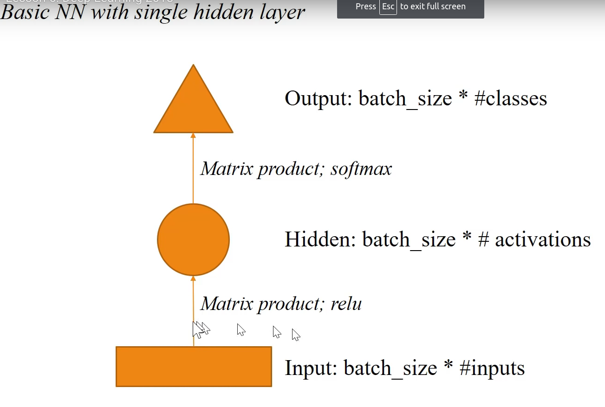
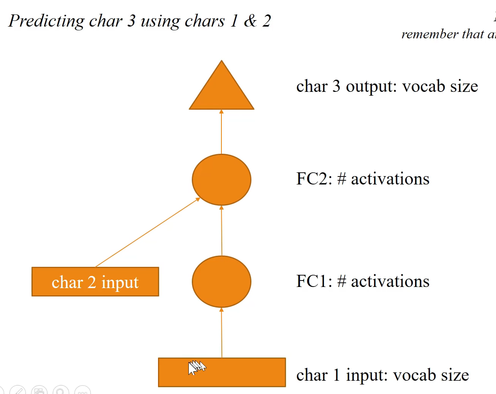
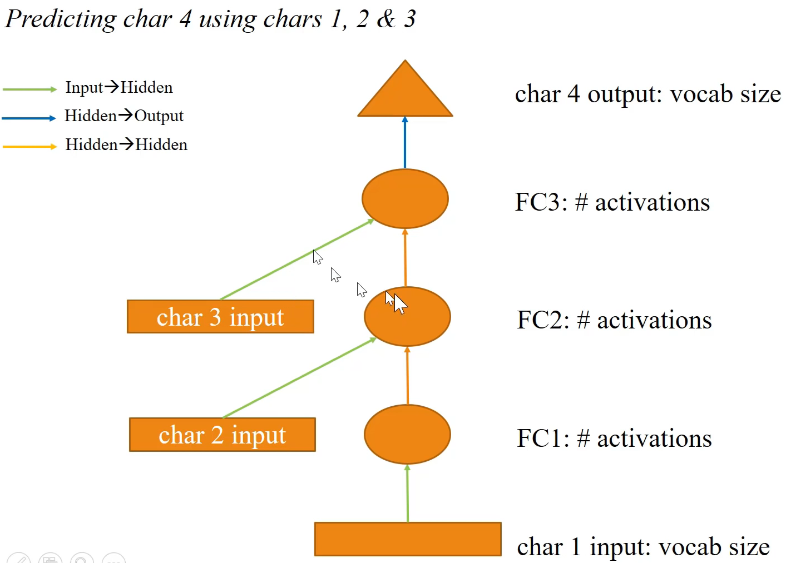
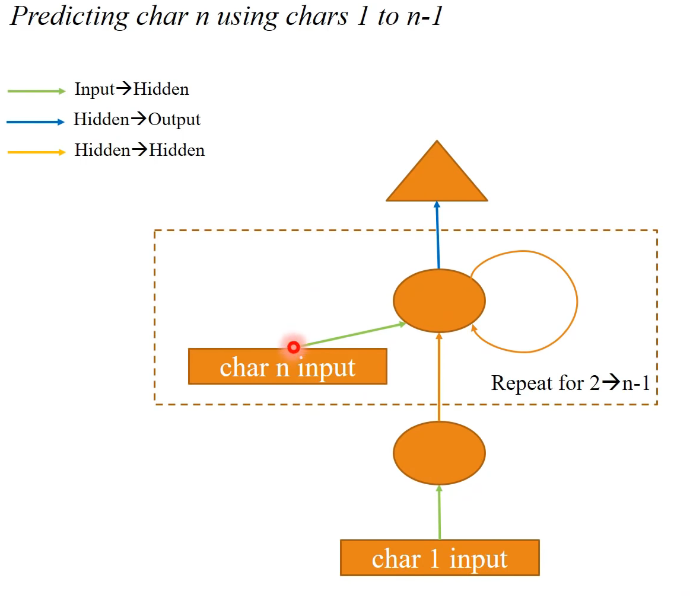
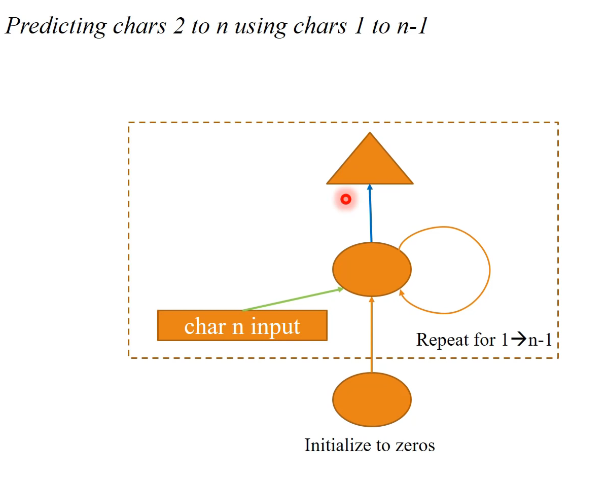

# Lesson 6: Interpreting Embeddings; RNNS from Scratch.


In embeddings, what we want to achieve is the embbedding learn the kind of taks we want for, not one random task. 

### Rossmann
We run `df = train[columns]` and run everything beneath it and then run `df = test[columns]` and again run the code beneath it. 

We use `apply_cats` rather than train cats to make sure the train and the test have the same categorical codes. We also add mapper to proc_df to keep track of the mean and sd of continuous columns. 

We need to be careful of the seasonality of the data. We can point out the increase before the store closses (weekends, vacations, etc).

With `tag` we can  use * to see the other place where the tags it's been used.

If we pass data without cats or conts, the model will create another columns with ones or zeros. *THIS IS A HACK TO BE IMPROVED*

The modules can't take list, so we call `nn.ModuleList()` to grab the content of the list and send them to a Module. In `MixedInputModel` we have a list of embeddings and we do the same to a list of linear layers with 
```python
nn.ModuleList([nn.Linear(szs[i], szs[i+1]) for i in range(len(szs)-1)])
```
so when we do `m = md.get_learner(emb_szs, ..., [1000, 500])` this is say how many activations we want, fit my linear layers. The same thing with drop outs. 

## Recurrent Neural Networks. 

We started out with SGD. *Look how to do this with pytorch 1.0* Or in the course-v3 part1.



Every shape is a bunch of activations. 
- Rectangle is the input activations. 
- Circle is hidden activations. 
- Triangle is output activations. 
- Arrow is a layer operation.


Batch size is in every layer. We remove relu and softmax because they are in every layer. 



In the lesson6-rnn-inpyn we use the usual:
```python
char_indices = {c: i for i, c in enumerate(chars)}
indices_char = {i: c for i, c in enumerate(chars)}
```

Every unique id to character and every character to unique id.

*Why a model of characters instead of a model of words?*
- You generally want to combine a word level with a character level model (translation, where you have an <UNK> word, you use a character level model for that; there's actually something between the 2 wich is call bite pair enconding (¿?) BPA).

For example, the first character would be 40, 42 and 29 (they are from x1, x2 and x3.  And we will be predicting 30 (y[:4]) which is the start of the next row (x1[:4] has 30. 


The actual model: 

All the arrows of the same color are going to use the same weigth matrix. So we are going to have 3 weight matrix. The idea is that the characters will have the same meaning independent of it's position in the sequence. 

```python 
class Char3Model(nn.Module):
    def __init__(self, vocab_size, n_fac):
        super().__init__()
        self.e = nn.Embedding(vocab_size, n_fac)

        # The 'green arrow' from our diagram - the layer operation from input to hidden
        self.l_in = nn.Linear(n_fac, n_hidden)

        # The 'orange arrow' from our diagram - the layer operation from hidden to hidden
        self.l_hidden = nn.Linear(n_hidden, n_hidden)  # This is a square weight matrix. 
        
        # The 'blue arrow' from our diagram - the layer operation from hidden to output
        self.l_out = nn.Linear(n_hidden, vocab_size)
        
    def forward(self, c1, c2, c3):
        in1 = F.relu(self.l_in(self.e(c1)))
        in2 = F.relu(self.l_in(self.e(c2)))
        in3 = F.relu(self.l_in(self.e(c3)))
        
        h = V(torch.zeros(in1.size()).cuda())
        h = F.tanh(self.l_hidden(h+in1))
        h = F.tanh(self.l_hidden(h+in2))  # We add in the other character
        h = F.tanh(self.l_hidden(h+in3))
        
        return F.log_softmax(self.l_out(h))
```

The trick was to make the square matrix `self.l_hidden = nn.Linear(n_hidden, n_hidden)` and to make sure that the sqaure matrix is the same size as the output of the hidden layer. 

In `ColumnarModelData.from_arrays(.., np.stack([x1, x2, x3],...)` np.stack() is going to be passed to the forward method args. 



Here's a simpler version and it's been implemented in 3 Our first RNN.:

And here is the implementantion:

```python
class CharLoopModel(nn.Module):
    # This is an RNN!
    def __init__(self, vocab_size, n_fac):
        super().__init__()
        self.e = nn.Embedding(vocab_size, n_fac)
        self.l_in = nn.Linear(n_fac, n_hidden)
        self.l_hidden = nn.Linear(n_hidden, n_hidden)
        self.l_out = nn.Linear(n_hidden, vocab_size)
        
    def forward(self, *cs):
        bs = cs[0].size(0)
        h = V(torch.zeros(bs, n_hidden).cuda())
        for c in cs:
            inp = F.relu(self.l_in(self.e(c)))
            h = F.tanh(self.l_hidden(h+inp))
        
        return F.log_softmax(self.l_out(h), dim=-1)
```
In hidden state to hidden state transition weight matrices we still tend to use tanh. (why?)

Maybe we shouldn't add h+inp together. The reason is that the input state and the hidden state are different kind of things. The input state is the encoding of the character and h is the encoding of the series of characters so far. So adding them together is going to potentially going to loose information. What if we concatenate this together?

```python
class CharLoopConcatModel(nn.Module):
    def __init__(self, vocab_size, n_fac):
        super().__init__()
        self.e = nn.Embedding(vocab_size, n_fac)
        self.l_in = nn.Linear(n_fac+n_hidden, n_hidden)
        self.l_hidden = nn.Linear(n_hidden, n_hidden)
        self.l_out = nn.Linear(n_hidden, vocab_size)
        
    def forward(self, *cs):
        bs = cs[0].size(0)
        h = V(torch.zeros(bs, n_hidden).cuda())
        for c in cs:
            inp = torch.cat((h, self.e(c)), 1)
            inp = F.relu(self.l_in(inp))
            h = F.tanh(self.l_hidden(inp))
        
        return F.log_softmax(self.l_out(h), dim=-1)
```

The trick is in troch.cat.
If u got different types of info you want to combine you generally want to concatenate it. Adding things with the same shape is loosing info. 

*The result* appears to be worst than the previuous approach (Why¿?).

## RNN with pytorch
```python
class CharRnn(nn.Module):
    def __init__(self, vocab_size, n_fac):
        super().__init__()
        self.e = nn.Embedding(vocab_size, n_fac)
        self.rnn = nn.RNN(n_fac, n_hidden)
        self.l_out = nn.Linear(n_hidden, vocab_size)
        
    def forward(self, *cs):
        bs = cs[0].size(0)
        h = V(torch.zeros(1, bs, n_hidden))  # We also need a starting point
        inp = self.e(torch.stack(cs))
        outp,h = self.rnn(inp, h)  # We pass in the starting poing. 
        
        return F.log_softmax(self.l_out(outp[-1]), dim=-1)
```

It's useful to get back the output and the hidden state. The hidden state is orange circle of our activations and it's of size 256.

In pytorch, rather than give you back the final elipse (the final hidden state) they concatenate all the hidden states; that's why we use outp[-1].

In pytorch, h is a 3-rank Tensor, this is usefull because you go can later set **BiRNN**.

**HOMEWORK**:
1. Try your own implementation of RNN class.
2. In `CharLoopConcatModel` we can implement that in every step we get an output.  

In the simpler version of the rnn loop, we also move in to the dashed rectangle the triangle, this means, spit up an output after every one of the circles. (e.g. if we have a 3 char input, we got 3 char output)

The first approach seems to be inefficient. We would take non-overlapping set of characters. This is implemented in **5 Multi-output model**

In `fit` we pass standard pytorch. The only special thing is md which wraps up the train, test and validation sets together. 


**Question about reseting the hidden state???**
- This is the idea of stateful RNN. 

A Simple Way to Initialize RNN of Rectified Linear Units - Quoc V.Le, Navdeep Jaitly, Geoffrey E. Hinton. 

