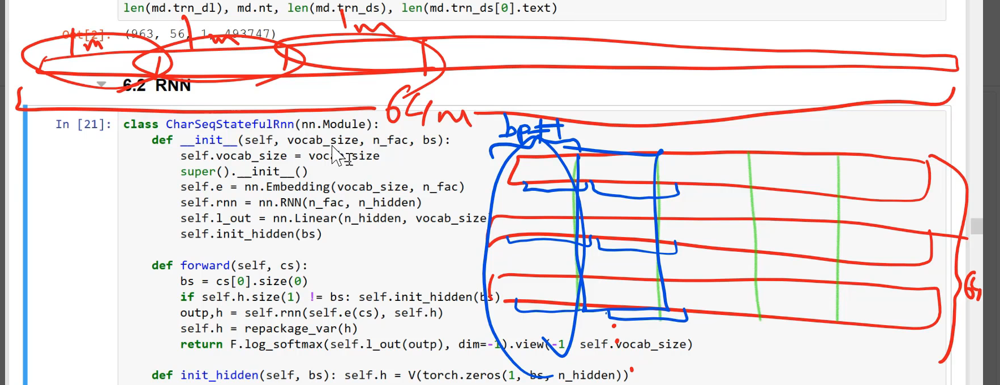
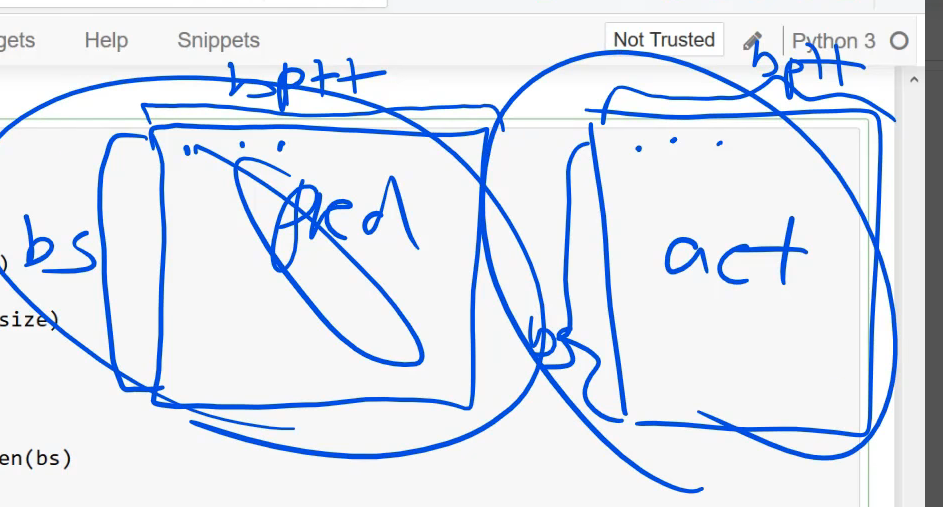
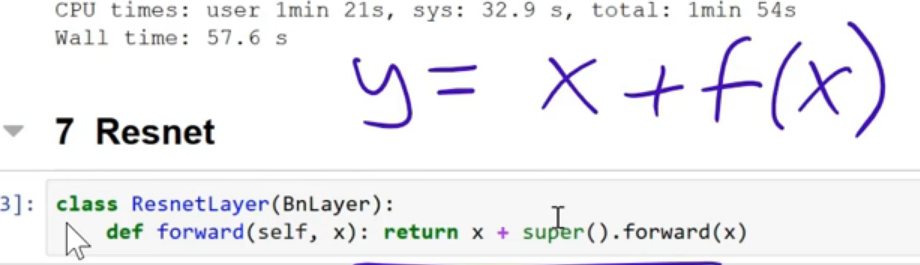
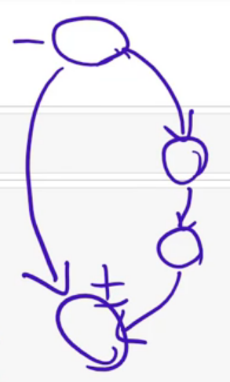

# Notes for lesson 7

## Multioutput model:
We use an entire section and use it to predict every one of the following characters. This was to make a better implementation than the previous one because in the previous one we train the model in the same characters a lot of time. 

The next concern is that we throw away the hidden state every time we go to the next section. So let's not throw away the matrix of h.

The problem was:
```python
class CharRNN(nn.Modele):
	.
	.
	.
	def forward(self, *cs):
	.
	h = V(torch.zeros(1, bs, n_hidden))
```

Every time we do a minibatch we begin our hidden states (orange circles).
- This is our new class.
```python 
class CharSeqStatefulRnn(nn.Module):
    def __init__(self, vocab_size, n_fac, bs):
        self.vocab_size = vocab_size
        super().__init__()
        self.e = nn.Embedding(vocab_size, n_fac)
        self.rnn = nn.RNN(n_fac, n_hidden)
        self.l_out = nn.Linear(n_hidden, vocab_size)
        self.init_hidden(bs)

    def forward(self, cs):
        bs = cs[0].size(0)
        if self.h.size(1) != bs: self.init_hidden(bs)
        outp,h = self.rnn(self.e(cs), self.h)
        self.h = repackage_var(h)
        return F.log_softmax(self.l_out(outp), dim=-1).view(-1, self.vocab_size)

    def init_hidden(self, bs): self.h = V(torch.zeros(1, bs, n_hidden))
```

Here we pass in self.init_hidden(bs) to the constructor. 
The line: `self.h = repackage_var(h)`: 
- If we were doing `self.h = h` and now we train it on a doc that is a million characters long. Then the size of the RNN (graph) has a million circles in it. So when we update our weights based on our errors, if we have a million characters, our unroll RNN is a million layers long so we have a 1 million fully conected layer;  so `class CharSeqStatefulRnn` is a 1 million layer fully conected layer. The problem with this is that is going to be very memory intensive. 

### Considerations:
1. So, we want to forget the history from time to time to avoid that. We still are getting the state but we can remember the state without remembering how we got there. That's where use `repackage_var` This approach is back prop through time. 

- `repackage_var`: grab the tensor out of it and create a new variable out of that. so this variable is going to have the same value but no history of operations. We are keeping our hidden state but not our hidden states history.

- Another reason to not backprop through many layers is that we have any kind of gradient instability, we avoid that. A longer value of bptt means your are able to track a longer memory. bptt is something  you get to tune. 

1. How we put our data into this?:

- We want to do a minibatch at a time. We want to look a section a predict the next part of the other one. And at the same time, we want to take an independent section and predict the nex part of other one and so forth. 
- We create 64 equally size minibatches. the minibatches are between the green lines. 
	- Each one is of size bptt. 



- Our first minibatch is all marked with a blue circle, and then we predict all of the following (offset by one). 

- *What about data augmentation?* 
  - One approach which won a kaggle competition randomly insert different rows. But this is something that needs to be look into more depth. 
- *How do we choose our bptt?*
 - Your matrix size of minibatch is bpttxminibatchsize. So one problem is that your gpu ram needs to be able to fit that by your embedding matrix. So one thing is you can reduce bptt is you have your loss to NaN because you have less layers. If it's too slow, you can try to decrease your bptt. (There is QRNN which runs this in parallel). 


In `TEXT = data.Filed(lower=True, tokenize=list)` we make sure that each minibatch contains a list of characters. 

`n_hidden`is the size of each of the circles. 
942 batches to go through = Number of tokens / Batch size / bptt.

In practice this is not exactly right. Pytorch randomize the size of bptt a little bit each time. So is going to be slighly different to 8 on avg. 
Is going to be constant per mini batch because we are multiplying h to the size of the minibatc. But the sequence can have different length. (The last minibatch size is probably going to be smaller). We handle this with:
```python
bs = cs[0].size(0)
if self.h.size(1) != bs: self.init_hidden(bs)
```

`TEXT.vocab.itos` is a list of unique characters. TEXT.vocab contains a lot of stuff. 

3. The loss functions such as softmax, are not happy receiving a rank-3 Tensor. We need to flat them out.



 - `F.log_softmax(self.l_out(outp), dim=-1).view(-1, self.vocab_size)` That's for the predictions. For the target, torch text knows that the targets needs to be of that shape so it do it for us. 

**Recap**
1. Get rid off the history. 
2. Recreate the hidden state if the batch size changes. 
3. Flatt the predictions out. 
4. Use torch text to create mini batches that line up nicely. 


**GRU**
RNNCell is not use in practice. The reason is that even tanh is used, you tend to find gradient explosions so we have to use pretty low learning rates and pretty small values of bptt. 

So we can replace de RNNCell with a GRUCell 

$ h_t = (1 - z_t) * h_{t-1} + z_t * \tilde{h}_t $

This equation is in [Understanding LSTMs](http://colah.github.io/posts/2015-08-Understanding-LSTMs/)

Another usefull [link](http://www.wildml.com/2015/10/recurrent-neural-network-tutorial-part-4-implementing-a-grulstm-rnn-with-python-and-theano/)

### LSTM (Putting it all together):

Instead of initiallize the optimizer in pytorch approach, we now use the fastai:
```python
lo = LayerOptimizer(optim.Adam, m, 1e-2, 1e-5)
```

The reason this exists is to do differential learning rates and differential weight decay. All the mechanics in fastai use this. So, if we want, callbacks or SGDr, we need to use this line. 


```python
cb = [CosAnneal(lo, len(md.trn-dl), cucle_mult=2, on_cycle_end=on_end)]
```

1. Update the learning rates in this lo (learning optimizer). 
2. The length of an epoch is len(md.trn-dl)
3. on_cycle_en=on_end => saves my model.


## Computer vision
### Cifar10

```python 
def get_data(sz, bs):
	tfms = tfms_from_stats(stats, sz, aug_tfms=[RandomFlipXY()], pad=sz//8)
	return ImageClassifierData.from_paths(PATH, val_name='test', tfms=tfms, bs=bs)
```

Normally, when we use pretrained model, we use tfms_from_model; that convert the dataset into a normalized dataset based on the mean and standard deviation of each chanel in the original model that was trained. 

This time, we don't have such thing. We are going to build a model from scratch. So we need to tell it the mean and sd of our data to normalized it.

so the line stats = (np.array(..)..) is the mean and sd of all the channels. 

Bash commands to set the data into right folders:

1. `cd train && find . | grep -o [a-z]*.png | sort -u && cd .`
2. `mkdir train_ test_`
3. `cd train_`
4. `mkdir airplane automobile bird cat deer dog frog horse ship truck`
5. `cd ..`
6. `function copytrain { for arg in $@; do cp $(find train -name '*'$arg'.png') train_/$arg/; done; };`
7. `copytrain $(ls train_ | grep -o "[a-z]*")`

Link to the notebook of [KeremTurgutlu](https://github.com/KeremTurgutlu/deeplearning/blob/master/study/Exploring%20Optimizers.ipynb)
We have one hidden layer model with SimpleNet. What we are doing is to build up to a ResNet.
We have 122880 parameters (3072 in features * 40 out features)
Nowdays, instead of maxpool convolution we use a stride 2 convolution. 

```python
class ConvNet(nn.Module):
    def __init__(self, layers, c):
        super().__init__()
        self.layers = nn.ModuleList([
            nn.Conv2d(layers[i], layers[i + 1], kernel_size=3, stride=2)
            for i in range(len(layers) - 1)])
        self.pool = nn.AdaptiveMaxPool2d(1)
        self.out = nn.Linear(layers[-1], c)

    def forward(self, x):
        for l in self.layers: x = F.relu(l(x))
        x = self.pool(x)
        x = x.view(x.size(0), -1)
        return F.log_softmax(self.out(x), dim=-1)
```
In the summary of learn, what we do to get the prediction of our classes is we use AdaptiveMaxPool2d: I'm not going to tell you big an area to pool, instead how big our resolution to create. 
AdaptiveMaxpool2d(1): find the max cell and use that as our activation.
**Check more of AdaptiveMaxpool**
```python 
class ConvLayer(nn.Module):
    def __init__(self, ni, nf):
        super().__init__()
        self.conv = nn.Conv2d(ni, nf, kernel_size=3, stride=2, padding=1)

    def forward(self, x): return F.relu(self.conv(x))


class ConvNet2(nn.Module):
    def __init__(self, layers, c):
        super().__init__()
        self.layers = nn.ModuleList([ConvLayer(layers[i], layers[i + 1])
            for i in range(len(layers) - 1)])
        self.out = nn.Linear(layers[-1], c)

    def forward(self, x):
        for l in self.layers: x = l(x)
        x = F.adaptive_max_pool2d(x, 1)
        x = x.view(x.size(0), -1)
        return F.log_softmax(self.out(x), dim=-1)
```
The last thing we pass into `ConvLearner.from_model_data` is the number of classes we want to predict. 
In **4 Refactored** we create a layer: *ConvLayer* and a model: *ConvNet2*. Now, because we add in padding, the input is 32 and the output is 16 and so on. 
The other thing, is that in the previous implementation, `nn.AdaptiveMaxPool2d` is an object but actually has no state.

Now we use `F:adaptive_max_pool2d`.

####To make the model more resilient, we now pass to 5 BatchNorm
We could use nn.BatchNorm be here we implement it from scratch. 
We want to normallize every layer, not just the inputs. 
```python
        x_chan = x.transpose(0,1).contiguous().view(x.size(1), -1)
        if self.training:
            self.means = x_chan.mean(1)[:,None,None]
            self.stds  = x_chan.std (1)[:,None,None]
				return (x-self.means) / self.stds *self.m + self.a
```
We get the mean and std of each channel and the result we substract the mean and divide it by std. Now, we don't need to normalize the input because it will do it automatically. 
It turns out that is now enough because SGD is going to go ahead and undo it the next minibatch. 

`nn.Parameter` that tells pytorch you allow to learn this as weights. pytorch learn these parameters by backprop. 

The reason we add *self.m + self.a is:
This scale the layer up, it doesn't need to scale up every single value in a matrix, it can just scale up the 3 numbers of self.m. If it needs to shift it all, it doesn't need to shift all the matrix, it just shift self.a (3 numbers).
Intuitively what's going on is:
We are normalizing the data and then, u can shift it and scale it using far fewer parameters that would be necessary to scale the entire set of convolutional filters. 
In practice what this does is:
1. Increase the learning rates.
2. Increase the resiliense of training. 
3. Allows us to add more layers. 

Another thing BatchNorm does is it add regularization to your model because `self.means` and `self.stds` changes in every Batch. In the original BatchNorm, you use an EWMA of the std and mean.

`if self.training` When we are training this will be true when is being applied to the training set, but will be false when we apply it to the validation set. 


`nn.Dropout` is already been set to check if you are using your validation set or your train set.
These things only apply when we use Dropout or BatchNorm.
In the pretrained network, with other frameworks, it changes self.means and self.stds regardless of the state of the layer (trainable or not). 
In FastAi, by default it won't touch those layers if your mean and std is frozen.
Unless you set learn.b.unfreeze = True. This will never change self.means and self.stds. 
We have BatchNorm after the Relu. Jeremy believes that in the original paper that's where they put it. 

The modern CNN structures, add a single conv layer at start, and a bigger kernel size. 
**Why?**
- We want our first layer to have a richer input. If we take a bigger area, (5 by 5 in this case) it allows me to find more reacher features so we spit out a bigger output (10 5 by 5 filters in this case). 
- Modern CNN structures use a single conv layers (5 by 5, or 7 by 7 or 11 by 11 convolution) with a few filters (32 filters comming out). 

`convBnNet2` is twice as deep, but we end up with the same 2by2 that we had before. 
But convBnNet2 hasn't help because we are now too deep for BatchNorm handling. 
We not replace it with ResNet.

### Resnet

```python
class ResnetLayer(BnLayer):
	def forward(self, x): return x + super().forward(x)
```
This line helps a lot, this is called a resnetblock 
**Why does it help?**

This is all we did. My predictions = my input + some function (in this case a convolution) of my input. 
We shift it to `f(x) = y -x` so what we are doing is trying to fit a function to the differences between y and x. The differences is actually the residual. y is the value we are trying to calculate and x is the most recent value beeing calculated. So the differences is basically the error of what I calculated so far. 

This is saying, try to find a set of convolutional weigths that attempts to fill the amount we are off by. 

Each time we got to a certain point to get a residual. So we are trying to fit a model to best fit that residual and add them to the previous model. This is *boosting* so adding `y = x + f(x)` we got *boosting* for free. 

```python
class Resnet(nn.Module):
    def __init__(self, layers, c):
        super().__init__()
        self.conv1 = nn.Conv2d(3, 10, kernel_size=5, stride=1, padding=2)
        self.layers = nn.ModuleList([BnLayer(layers[i], layers[i+1])
            for i in range(len(layers) - 1)])
        self.layers2 = nn.ModuleList([ResnetLayer(layers[i+1], layers[i + 1], 1)
            for i in range(len(layers) - 1)])
        self.layers3 = nn.ModuleList([ResnetLayer(layers[i+1], layers[i + 1], 1)
            for i in range(len(layers) - 1)])
        self.out = nn.Linear(layers[-1], c)

    def forward(self, x):
        x = self.conv1(x)
        for l,l2,l3 in zip(self.layers, self.layers2, self.layers3):
            x = l3(l2(l(x)))
        x = F.adaptive_max_pool2d(x, 1)
        x = x.view(x.size(0), -1)
        return F.log_softmax(self.out(x), dim=-1)
```

The full **resnet** does not look like this. It doesn't have just one convolution, it has two convolutions. The full **resnet** looks like this: 


- It gets two convolutions and then add them back to the original input. 
- The first one is not a *resnet block* but a standard convolutioni with a stride of 2. This is called *bottleneck layer* From time to time we change the geometry with stride=2. 

The best **resnet* is called **preact resnet** 


