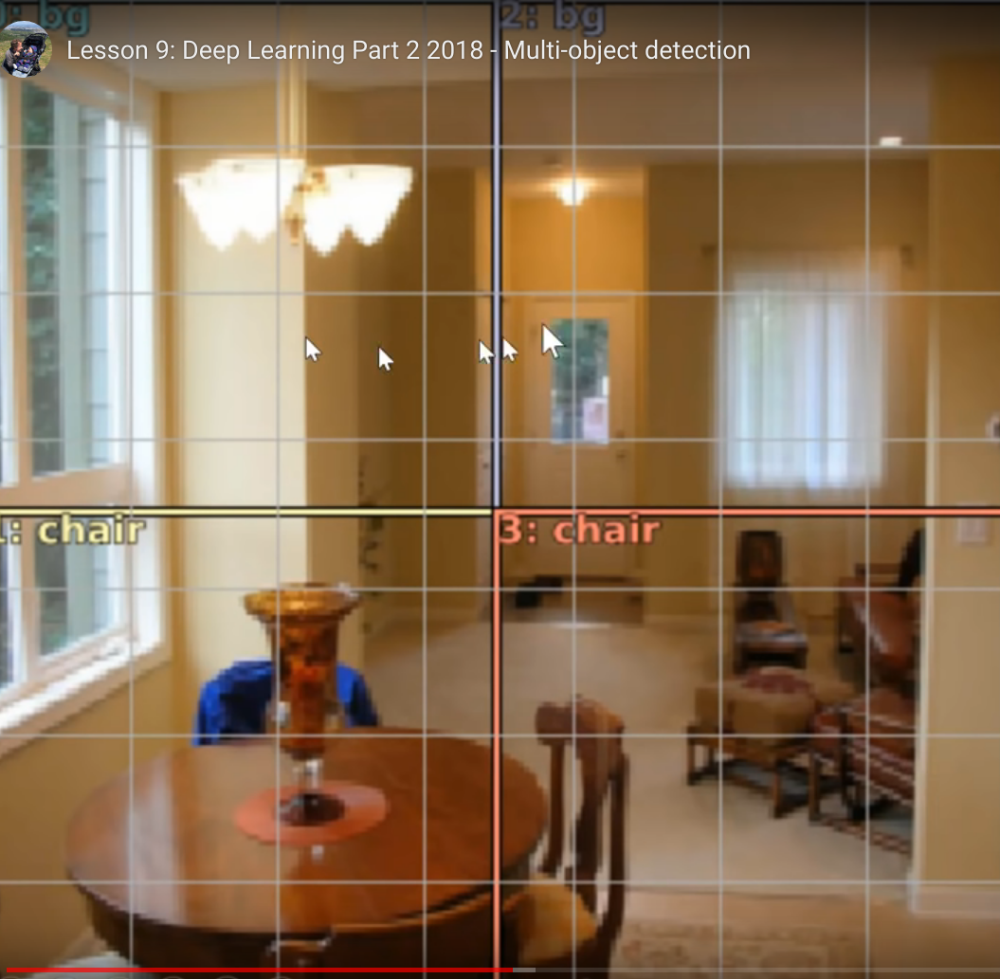
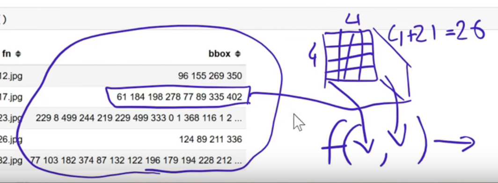
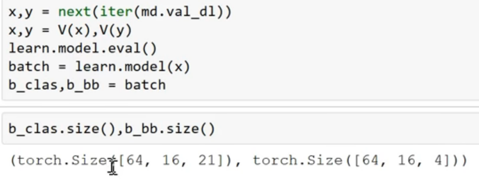
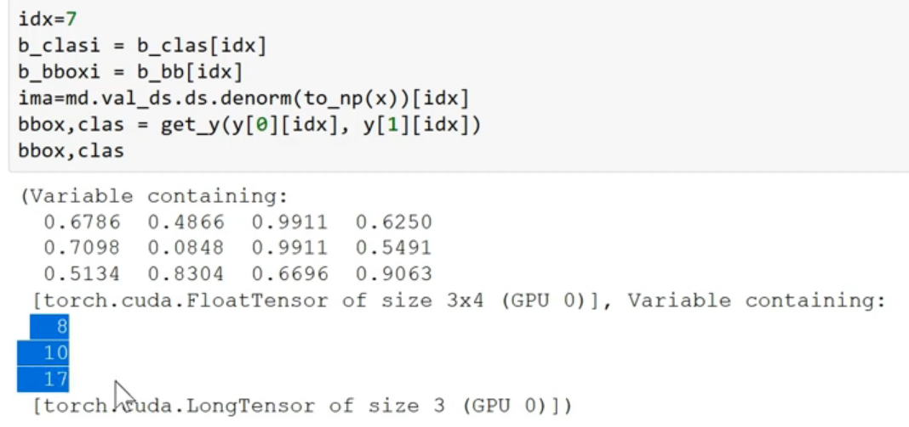
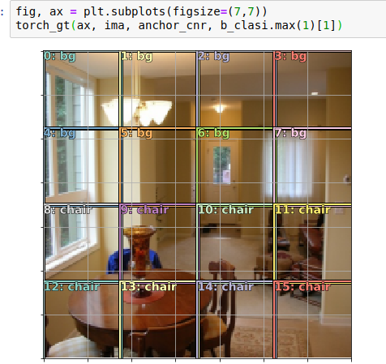
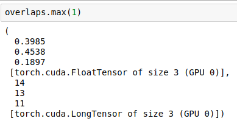
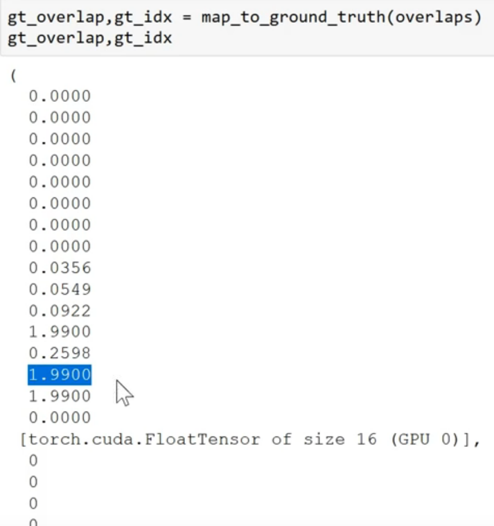

# Lesson 8

#### What we should know from part 1
- How to view model inputs from a Dataloader
```python
x, y = next(iter(md.val_dl))

ima = md.val_ds.denorm(to_np(x))[0]

b = bb_hw(to_np(y[0])); b
```

- How to view model outputs
```python
x,y = next(iter(md.val_dl))
learn.model.eval()
preds = to_np(learn.model(VV(x)))
```

In data augmentation, we need to know that all our dependent variables need to pass through all the data augmentations (geometric transformations) our independent variables as been pased. 

So to do that, every transformations has a optional transform *y* parameter. It takes transform type enum. 
- COORD option states that the *y* values represent Coordinates. In this case bounding box coordinates. 
  - If you flip, you need to flip the coordinates. 

  We also add this transformations to `tfms_from_model` 
  
To avoid the problem of the bounding boxes being akward when we do the aumentation, we can set the maximum rotation of RandomRotate to 3. 

The `nn.Linear(25088,4)` that we have is because before we flatten out the ConvLayers, we have the input shape of `[-1, 512, 7, 7]` so `512*7*7` is 25088·

4 is because we have 4 bounding boxes. 

The 3 things we need to provide when building Deep Learning models are:
1. Data
2. Architechture
3. Loss function

#### Data
We need a ModelData object which has as the independence de images and the depence we want a tuple (bounding box coords, class).

We create two `ImageClassifierData` one for the bounding boxes an the other one for the clases. 

We merge them togheter with:

```python
class ConcatLblDataset(Dataset):
    def __init__(self, ds, y2): self.ds,self.y2 = ds,y2
    def __len__(self): return len(self.ds)
    
    def __getitem__(self, i):
        x,y = self.ds[i]
        return (x, (y,self.y2[i]))
```

With a dataset class. A DataSet class is anythhing which has len and index (`__getitem__`). 

The constructor has an existing data set (so that's going to have the independent and the dependent) and the second dependent is the len of the dataset. 

#### Architecture
The arch has the classifier and the bounding box regresion. 

Because there are `c` classes, the number of activations in the last layer is 4 (bbox coords and c probabilities, one per classes) **why?** 

In `head_reg4` the reason why there's not a BatchNorm after Relu() is because the ResNet already has a BatchNorm as it's final layer. 

In this `head_reg4` we have 2 linear layers. 

#### Loss Function

The loss function needs to see at the 4 + len(cats) and decide if they're good. 
- For the first 4, we use L1, and for the rest of the activations (len(cats)) we can use cross-entropy loss. 

- Then, we create a **detection_loss** function.
 - `bb_i, c_i = input[:, :4], input[:, 4:]`
	 - The bounding boxes and the classes of the input are the first 4 of the input and the 4 onwards elements of the input. Because we already have a Batch dimentions, we need to grab the all thing. 
 - For the bounding boxes, we need that they will be between 0 and 224 because that's the size of our images. The `F.sigmoid(bb_i)` is between 0 and 1.

**Is it better to put BatchNorm after or before Relu?**
- Suggestion: We should put it after relu, because batchnorm is ment to move towards 0 and 1 random variable and if you put relu after then you are truncating that to zero. 

**Why we put Dropout after BatchNorm if BatchNorm already has a regularization effect?**
- Because sometimes even with BatchNorm we could overfit and because Dropout have the *probability* parameter to allow us to put different values and control overfitting. 

In `def detn_loss` the two losses are in different scale so with the debugger we can check by which value multiply to scale them to be about the same **Implications of this??**

**Why does the l1 loss is lower when we train it with `detn_acc` as oppossed when we do that independently?**
- The intuition is because we gain the shared information of the classifier of the bounding boxes because you are know looking for an object and checking which object is what you're looking for. As a result, you shared the information. So when we backpropagate the error in the class and in the place, you have a lot more information. 
  
The problens are that the boxes are not perfect (example of dog) and when there are 2 birds for example, it just put the bounding box in the middle. 

## MultiLabel Classification

Search to the way of doing things with Pandas instead of dict or list comprehensions mentioned in minute 27:00 of video.

One little detail we use is:
```python
mc = [set[cats[p[1]] for p in trn_anno[o]]) for o in trn_ids]
```

We use set because we don't want an entire list of all the cats, we want a list of unique cats. By doing this we avoid that the annotation is being displayed several times in the image.
#### Architecture
#### Bbox per cell


`nn.Linear(-1`
-1: however many inputs and 4+c outputs. 
Rather than 4+c outputs, we could have 16*(4+c) outputs. 
Now we have 16 sets of probs and 16 sets of coordinates and after that we just need a loss function that could check whether does 16 sets of bounding boxes correctly represent the objects in the image. 

2. The second way to do it: Rather than have a nn.Linear, instead we add it nn.Conv2d(stride=2) and now we have a tensor where the number of elements is exactly the number of elements we wanted. 

Things are moving towars SSD. 
So if we add another nn.Conv2d(stride=2), basically the result will be:

Stride 2 does the same to the geometry of activations as a stride 1 convolution follow by a MaxPooling. 

Every box will be responsible to find the object within it's area. So the loss function will tell the grids that they are responsable for detections the bigger object in that part of the image. 

**Receptive Field:** in your convolutional layers, every pieze of those tensors has a receptive field which means which part of the input images was responsable for calculating that cell. 


```python
class OutConv(nn.Module):
    def __init__(self, k, nin, bias):
        super().__init__()
        self.k = k
        self.oconv1 = nn.Conv2d(nin, (len(id2cat)+1)*k, 3, padding=1)
        self.oconv2 = nn.Conv2d(nin, 4*k, 3, padding=1)
        self.oconv1.bias.data.zero_().add_(bias)
        
    def forward(self, x):
        return [flatten_conv(self.oconv1(x), self.k),
                flatten_conv(self.oconv2(x), self.k)]
```
This is going to spit out to sets of activations, one for the bounding boxes and one for the classifier. 
In the line `self.oconv1 = nn.Conv2d(nin, (len(id2cat)+1)*k, ...` we are adding one because we have one more class: the background. 
```python
def flatten_conv(x,k): return x.view(x.size(0), x.size(1) // k, -1).transpose(1, 2)
```
We flatten out the convolution because the loss function expects a flatten out tensor but we can rewrite it to not expect that. 

#### The loss function
It needs to look at each of the 16 sets of activations, each one will have 4 bbox coordinates and c+1 class probabilities, and decide if those activations are close of far away of the objects which is closest to the grid cell in the image; if there's nothing there,  you are predicting background. 

##### We have a matching problem:

This is how we create or loss function, where you have a big value if it's activations are not a good reflection of the ground truth bounding boxes and a lower value if it's a good reflection of the bounding boxes. 
The general approach to create that function is:



1. Grab our validation set DataLoader; grab a batch from it. 
2. Turn it into a variable so we can stick it into a model.
3. Put the model in evaluation mode. 
4. Stick that data into the model to grab a batch of activations. 
5. Because the final output convolution returns two items (classes, and bounding boxes) 

- 64: Batch of class outputs.
- 16: Grid cells.
- 21: classes
- 4: Bounding Box coordinates. 
**CHECK WHY THIS ARE THE VALUES!** 


The ground truth is in the *y* variable, so we grab the bounding box part and the class part and put them into python variables and we print them out so we have the ground truth bounding boxes and classes. 
```python
def torch_gt(ax, ima, bbox, clas, prs=None, thresh=0.4):
    return show_ground_truth(ax, ima, to_np((bbox*224).long()),
         to_np(clas), to_np(prs) if prs is not None else None, thresh)
```
`torch_gt` simply converts the tensors into numpy and passes them along so we can print them out. 
All the values of the bbox coordinates are between 0 and 1 because we are treating images like 1 by 1 and all the bbox coordinates are relative of the size of the images. 

This is our 4 by 4 grid cell from our final convolutional layer: Anchor boxes, prior boxes of default boxes. 
**The matching problem** is that we need to see which one of the 16 anchor boxes has the higher overlap with the ground truth bboxes. To do that we need to mesure the amount of overlap and the standar function for that is de `jaccard_index`:
```python
def jaccard(box_a, box_b):
    inter = intersect(box_a, box_b)
    union = box_sz(box_a).unsqueeze(1) + box_sz(box_b).unsqueeze(0) - inter
    return inter / union
```
Take the intersection divided by the union. 
Jaccard is also know as the `iou`: interseccion over union. 
We are going trough and find the jacard overlapp for each one of the 3 objects vs each one of the 16 anchor boxes and that is going to give us a 3x16 matrix. 


Here pytorch `max` over dimention 1  give us two things: 
1. What is the max.
2. Index of the max. 

`max` over dimention 0 give us:
1. Maximum amount of overlap for each grid cell accross all of the ground truth objects. 




<mark>marked text </mark>
<span style="background-color: #de1c24">Marked text </span>


**TODO**
1. Understanding receptive field. [Medium post](https://medium.com/mlreview/a-guide-to-receptive-field-arithmetic-for-convolutional-neural-networks-e0f514068807)
